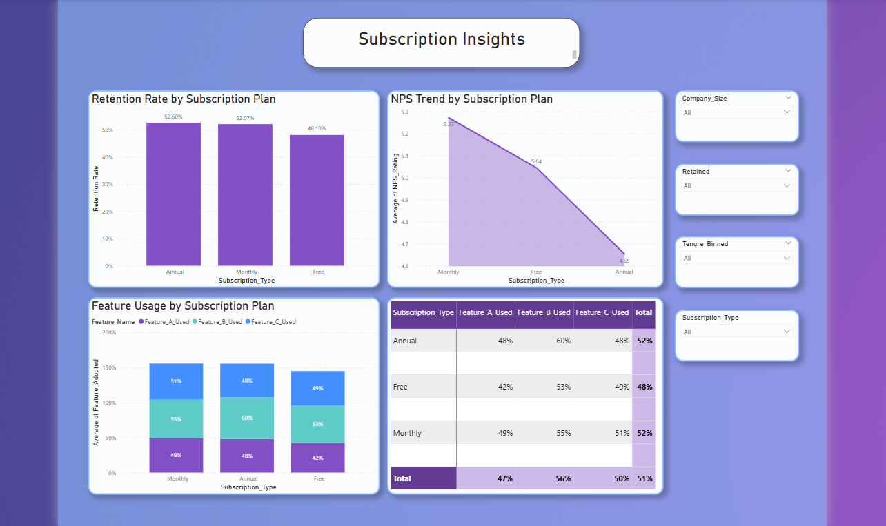

# Feature Usage & Retention Strategy Dashboard – SaaS Insights

A comprehensive Business Analytics project designed to **analyze user behavior, feature adoption, and customer retention** for a SaaS product. Built using **Power BI**, **SQL**, and **Python** for stakeholder-ready insights.

---

##  Objective

To uncover behavioral patterns and retention signals by analyzing:
- Feature adoption across segments
- Retention by tenure, plan, and company size
- NPS satisfaction vs engagement metrics
- At-risk user identification using custom DAX and segmentation

---

##  Dataset Summary

- **Name**: `Feature_Usage_Retention_Dataset.csv`
- **Fields**:
  - `Customer_ID`, `Company_Size`, `Subscription_Type`
  - `Feature_A_Used`, `Feature_B_Used`, `Feature_C_Used`
  - `Login_Frequency`, `Tenure_Months`, `Last_Interaction_Days`
  - `NPS_Rating`, `Feature_Adoption_Score`, `Retained`

---

##  Tools Used

| Tool         | Purpose                                           |
|--------------|---------------------------------------------------|
| **Power BI** | Visual storytelling dashboard & DAX logic        |
| **SQL**      | Query simulation for user logs & aggregation     |
| **Python**   | Correlation heatmaps, scatter plots for insight  |
| **GitHub**   | Documentation & versioning                       |
| *(Optional)* Figma | UI improvements from adoption gaps         |

---

##  Value of SQL & Python in This Project

###  SQL
Simulates raw user events and account joins:
- Login counts by user
- Feature usage matrix
- Retention % by plan
- NPS → login correlation

> Stakeholder Value: Recreates realistic data pipelines, enables quick insight generation from operational DBs.

###  Python
Used for:
-  Heatmap correlation matrix of key metrics
-  NPS vs Login Frequency scatter plot

> Stakeholder Value: Data-backed validation of dashboard insights via statistical patterns.

---

##  Dashboard Overview – Power BI (4 Insightful Pages)

This dashboard was designed to provide stakeholders with an interactive, end-to-end view of user behavior, feature adoption, and churn risk signals. Each page serves a distinct strategic purpose:

---

###  Page 1 – Executive Summary

####  Purpose:
Gives a high-level snapshot of product health and retention across key user segments.

- **KPI Cards**: Retention Rate, Avg Feature Adoption, Avg NPS, Avg Login Frequency  
  → *Quick view of overall performance metrics*
  
- **Clustered Bar**: Retention % by Company Size  
  → *Identifies which company sizes are more loyal or churn-prone*

- **Stacked Bar**: Feature A+B+C Usage among Retained Users  
  → *Highlights which features contribute to long-term usage*

- **Donut Chart**: Subscription Type Distribution  
  → *Shows how many users fall into Free, Monthly, or Annual tiers*

- **Combo Chart**: Login Frequency vs Retention by Tenure Bucket  
  → *Reveals the lifecycle stage where retention starts dropping*

---

###  Page 2 – Customer Behavior Deep Dive

####  Purpose:
Analyzes user behavior patterns to surface retention drivers and satisfaction signals.

- **Stacked Bar**: Feature A/B/C Usage by Retention  
  → *Compares which features are used more by retained vs churned users*

- **Scatter Plot**: NPS Rating vs Login Frequency by Retention  
  → *Maps satisfaction vs engagement to spot risk segments*

- **Horizontal Bar**: Avg Feature Adoption by Company Size  
  → *Highlights how adoption varies by business scale*

- **Bar Chart**: Login Frequency by Company Size  
  → *Analyzes engagement frequency patterns across companies*

 *Supports product managers in refining feature strategies and targeting feature adoption campaigns.*

---

###  Page 3 – Subscription Insights

####  Purpose:
Evaluates how different subscription plans affect retention, satisfaction, and feature usage.

- **Column Chart**: Retention Rate by Subscription Type  
  → *Identifies which plans retain users better*

- **Line Chart**: NPS Trend by Plan  
  → *Shows satisfaction levels across different plans*

- **Stacked Bar**: Feature Usage % by Subscription  
  → *Determines if premium users use more features*

- **Matrix**: Feature Adoption Score breakdown by Plan  
  → *Supports upsell/cross-sell opportunities based on usage patterns*

 *Helps marketing and product teams personalize plan offerings and pricing.*

---

###  Page 4 – At-Risk Signals

####  Purpose:
Pinpoints users most at risk of churning using behavioral thresholds and predictive DAX.

- **Bar Chart**: Users with Last Interaction > 30 Days  
  → *Flags dormant users who haven’t logged in recently*

- **Donut Chart**: High Risk vs Low/Moderate Segmentation  
  → *DAX-defined risk label combining low NPS, low feature usage, and inactivity*

- **Combo Chart**: NPS + Feature Drop by Retention  
  → *Correlates satisfaction and usage decline together*

- **100% Stacked Bar**: Churn vs Retention by Tenure Bucket  
  → *Visualizes churn across the customer lifecycle*

- **Card DAX Alert**: Stable Retention / Drop Signal  
  → *Dynamic logic to signal trend reversals or stability in retention*

 *Empowers CS teams to proactively intervene, re-engage, or design win-back campaigns.*

---
##  Key Insights

-  **Retention peaks at 6–24 month tenure**; drops sharply after 30 months.
-  **Feature B usage has strongest correlation with retention**.
-  **NPS ratings align closely with login frequency** – indicating engagement drives satisfaction.
-  **Customers with low NPS & low feature use + no login in 30+ days = at-risk**.
-  Monthly and annual plans outperform free in retention & adoption scores.

---

##  Recommendations

1.  **Onboarding Focus** – Improve early stage (0–6 month) experience to drive adoption.
2.  **Engage High-Tenure Churners** – Re-engage users with 30+ months tenure and low usage.
3.  **At-Risk Alerts** – Monitor inactivity + low NPS + low feature users using DAX logic.
4.  **Feature B & C Promotion** – Promote features with high retention correlation.
5.  **Plan-based Campaigns** – Incentivize free users to upgrade, as paid tiers retain better.

---

## Project Files

| File Name                  | Description                                         |
|---------------------------|-----------------------------------------------------|
| `Feature_Usage_Retention_Dataset.csv` | Main dataset                              |
| `SQL_queries.sql`          | Simulated SQL logic for aggregation                 |
| `retention_analysis.py`    | Python correlation + scatter plots                  |
| `correlation_heatmap.png`  | Visual heatmap of metric relationships              |
| `nps_vs_login_scatter.png` | Engagement vs Satisfaction Segmentation             |
| `Feature Usage & Retention Dashboard.pbix` | Power BI report file               |

---

## References & Tools

- Power BI | SQL | Python (pandas, seaborn, matplotlib)
- Dataset simulated for educational/portfolio use
- All visuals, insights, and logic designed by **Linusha**

---

> © 2025 | Project by Linusha | Business Analytics Portfolio  
